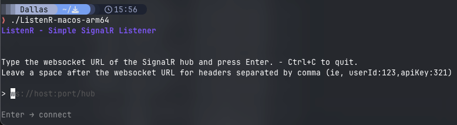
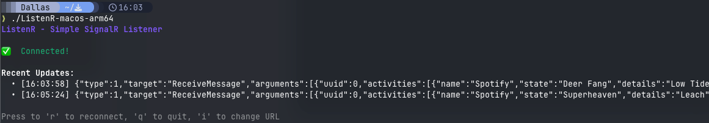
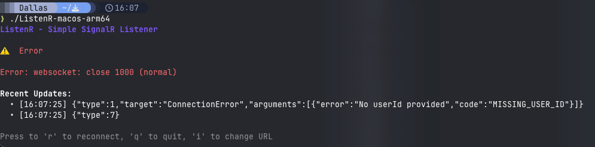

# Minimal Listener for SignalR

Built this because I couldn't get Postman/Yaak/Bruno to play nice with SignalR.

## Features
- Supports ws/wss protocol
- Allows transmission of headers during initial negotiation (OnConnectedAsync)
- Live connection/disconnected status
- Easy reconnects

Doesn't support sending of messages to the group, only listens for messages transmitted

Currently very bare bones, will add more to this as I need. Feel free to submit a pull request or fork for your own use

### Screenshots




## Usage
1. ```go run .```   
2.  Follow prompts and enter server url and headers if needed


## Compile
1. ```go build```

Made with [BubbleTea](https://github.com/charmbracelet/bubbletea), [LipGloss](https://github.com/charmbracelet/lipgloss) and [Websocket](https://github.com/gorilla/websocket)
